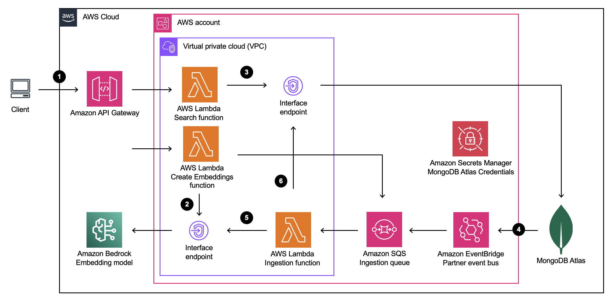
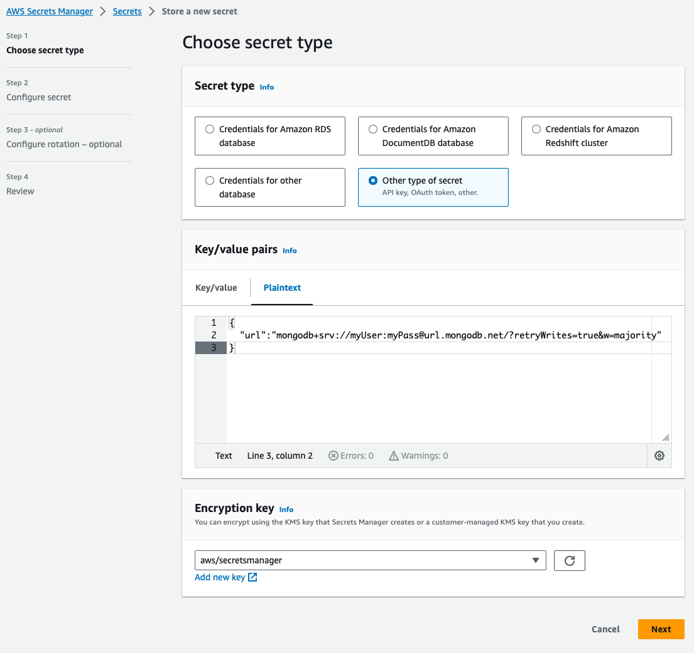
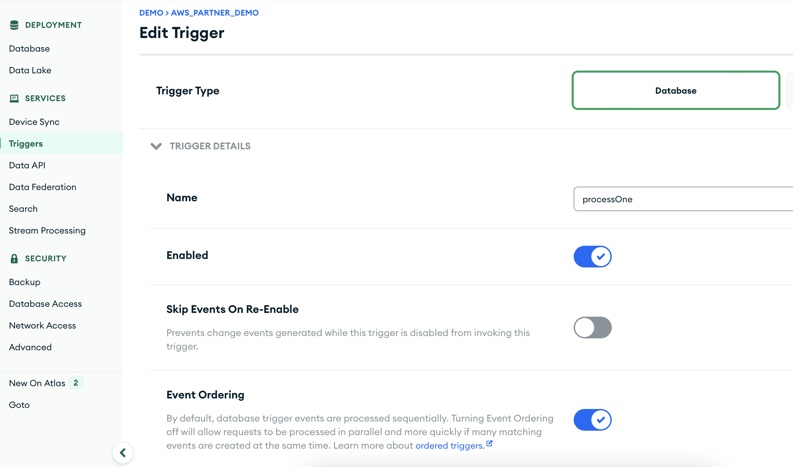
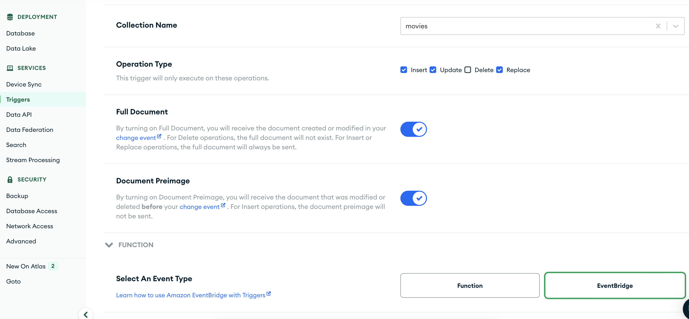
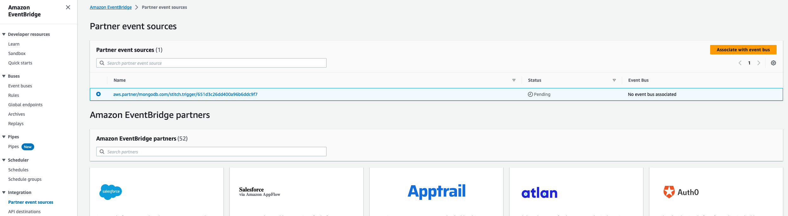
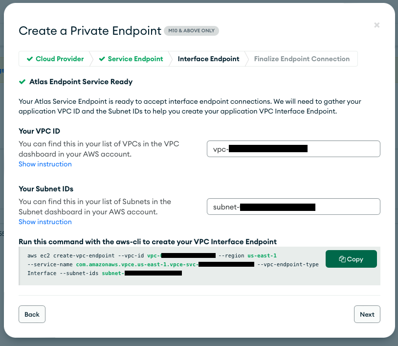

# Semantic search with MongoDB Atlas and Amazon Bedrock

## Solution overview

This repository contains a sample application that demonstrates how to build a semantic search API using MongoDB Atlas and Amazon Bedrock. The sample application uses the [MongoDB Atlas sample data](https://docs.atlas.mongodb.com/sample-data/available-sample-datasets/) and the [MongoDB Atlas search index](https://www.mongodb.com/docs/atlas/atlas-search/field-types/knn-vector/) to perform vector search on the `movies` collection in the `sample_mflix` database. The sample application uses the Titan Embeddings model via the [Amazon Bedrock](https://aws.amazon.com/bedrock/) API to generate word embeddings for the documents in the `movies` collection. It uses [Amazon EventBridge](https://aws.amazon.com/eventbridge/) to trigger a Lambda function that updates the `plot_embedding` field for the documents in the `movies` collection.



> **Warning**
> This application is not ready for production use. It was written for demonstration and educational purposes. Review the [Security](#security) section of this README and consult with your security team before deploying this stack. No warranty is implied in this example.

> **Note**
> This architecture creates resources that have costs associated with them. Please see the [AWS Pricing](https://aws.amazon.com/pricing/) page for details and make sure to understand the costs before deploying this stack.

## Deployment instructions

### Prerequisites

- Node.js 18.x or later install [here](https://nodejs.org/en/download/) or via [nvm]([http](https://github.com/nvm-sh/nvm))/[fnm](https://github.com/Schniz/fnm)
- An AWS account (create one [here](https://aws.amazon.com/premiumsupport/knowledge-center/create-and-activate-aws-account/))
- A MongoDB Atlas account (create one [here](https://www.mongodb.com/cloud/atlas/register)) with a M10+ cluster
- [AWS CDK](https://docs.aws.amazon.com/cdk/v2/guide/getting_started.html#getting_started_install) to deploy the stack
- [curl](https://curl.se/download.html) 7.75.0 or later for making HTTP requests to the API. Alternatively you can use an API client if you prefer.
- (Optional) [jq](https://stedolan.github.io/jq/download/) 1.6 or later for parsing JSON responses from the API

### Prepare the AWS environment

> **Note**
> This section assumes that you already have an AWS account and that you have enough permissions to create and manage AWS Secrets Manager secrets. To create a secret, you need the permissions granted by the `SecretsManagerReadWrite` [AWS managed policy](https://docs.aws.amazon.com/secretsmanager/latest/userguide/reference_available-policies.html).

Before deploying the stack, you need to create a new AWS Secrets Manager secret to store the MongoDB Atlas credentials. These credentials will be used by the Lambda functions in the stack to connect to MongoDB Atlas.

Follow the instructions [here](https://docs.aws.amazon.com/secretsmanager/latest/userguide/manage_create-basic-secret.html) to create a new AWS Secrets Manager secret. When creating the secret, make sure to select the `Other type of secrets` option as shown in the screenshot below:



The secret must be a JSON object with the following structure:

```json
{
  "url": "mongodb+srv://<username>:<password>@<cluster-url>/test?retryWrites=true&w=majority"
}
```

> **Important**
> Make sure to replace the `<username>`, `<password>`, and `<cluster-url>` placeholders with the appropriate values for your MongoDB Atlas cluster. You can find the connection string for your cluster by following the instructions in the [MongoDB Atlas documentation](https://www.mongodb.com/docs/guides/atlas/connection-string/).

Once you have created the secret, take note of the secret name. You will need it later when deploying the CDK stack.

### Create MongoDB cluster (optional)

Before deploying the CDK stack, you need to create a MongoDB Atlas cluster (M10 or higher) and load the sample data from the [MongoDB Atlas sample data](https://docs.atlas.mongodb.com/sample-data/available-sample-datasets/) into the cluster.

Follow the instructions [here](https://www.mongodb.com/docs/guides/atlas/cluster/) to create a new MongoDB Atlas cluster. Make sure to deploy the cluster to the appropriate AWS Region. This sample assumes that you're using `us-east-1`. Then, follow the instructions [here](https://docs.atlas.mongodb.com/sample-data/available-sample-datasets/) to load the sample data into the cluster.

The following instructions will guide you in setting up semantic search for the `movies` collection in the `sample_mflix` database in the Atlas sample data set.

> **Note**
> If you already have a MongoDB Atlas cluster with the sample data loaded, or if you want to use your own data, you can skip this step. Note that you will have to adapt the instructions in the next section to match your data, as well as updating the collection, database, index, and field names in the `functions/commons/constants.ts` file.

### Create vector search index

In order to perform vector search, you need to create a [search index](https://www.mongodb.com/docs/atlas/atlas-search/field-types/knn-vector/) on the collection you want to search. The search index defines the fields that will be indexed and the weights for each field.

Follow the instructions [here](https://www.mongodb.com/docs/atlas/atlas-search/field-types/knn-vector/#std-label-fts-data-types-knn-vector) to create a search index named `default` on the `movies` collection in the `sample_mflix` database, use the following JSON:

```json
{
  "mappings": {
    "dynamic": true,
    "fields": {
      "plot_embedding": {
        "dimensions": 1536,
        "similarity": "cosine",
        "type": "knnVector"
      }
    }
  }
}
```

### Set up Atlas trigger with EventBridge integration

Using [Atlas App Services](https://www.mongodb.com/atlas/app-services), you can set up an Atlas Database Trigger to [send new and updated documents to Amazon EventBridge](https://www.mongodb.com/docs/atlas/triggers/eventbridge/).

First, create a MongoDB Database Trigger:

1. Navigate to the "Triggers" tab in your Atlas cluster and click the "Add Trigger" button.
1. Select the "Database" trigger type and provide a name for your trigger (i.e. `processDocs` or `movie-change-stream`).
1. Then, check the "Enable" and "Event Ordering" checkboxes.
1. Next, select the data source information for your trigger.
   
1. Select the "Insert", "Update, and "Replace" operation types and enable the "Full Document" and "Document Preimage" checkboxes.
1. Next, select the "EventBridge" integration and input your AWS account ID and AWS Region.
   
1. Finally, open the "Advanced" section and input the following JSON in the "Match Expression" field:
   ```json
   {
     "updateDescription.updatedFields.plot": {
       "$exists": false
     }
   }
   ```

The match expression will instruct the trigger to only send events if the `plot` field of the document has changed.

Next, head over to the AWS Console and navigate to the Amazon EventBridge console. Make sure you are in the correct AWS Region that matches the one you selected in the Atlas trigger configuration. After selecting "Partner event source" in the left navigation pane, you should see a new event source with the name `aws.partner/mongodb.com/stitch.trigger/<trigger-id>` and status "Pending".



Select the event source and click the "Associate with an event bus" button. Then follow the prompts using default values and confirm. After a few seconds the event source status should change to "Active".

Copy the EventBridge Event Bus name (i.e. `aws.partner/mongodb.com/stitch.trigger/<trigger-id>`) and take note of it. You will need it later when deploying the CDK stack in the next section.

### Deploy CDK stack

```bash
AWS_REGION=us-east-1 cdk deploy \
    --paramters EventBridgePartnerEventBusName=aws.partner/mongodb.com/stitch.trigger/<trigger-id> \
    --parameters MongoDBConnectionStringSecretName=<secret-name>
```

After a few minutes the stack should complete its deployment and display some outputs in the terminal similar to the ones below:

```text
 ✅  MongodbBedrockSemanticSearchStack

✨  Deployment time: 431.82s

Outputs:
MongodbBedrockSemanticSearchStack.NetworkMongoDBAtlasEndpointSecurityGroupIDFDDD2BC5 = sg-05486e6e9559217b2
MongodbBedrockSemanticSearchStack.VPCID = vpc-0c2ba4bebb0afb9d1
MongodbBedrockSemanticSearchStack.VPCPrivateSubnetID = subnet-0caaf20998e3f2c2e
MongodbBedrockSemanticSearchStack.SearchAPIEndpoint00DDC7C4 = https://noy576fxv1.execute-api.us-east-1.amazonaws.com/prod/
Stack ARN:
arn:aws:cloudformation:us-east-1:123446789101:stack/MongodbBedrockSemanticSearchStack 72641650-62a2-11ee-9fdd-0abc46bc1f9b

✨  Total time: 452.18s
```

Take note of VPC ID, subnet IDs, and Security Group ID in the output, you will use it in the next step to create the PrivateLink between the VPC and MongoDB Atlas.

### Set up private MongoDB cluster endpoint and interface

Next, you will set up a private MongoDB cluster endpoint and interface to allow the Lambda functions in the stack to connect to MongoDB Atlas via [AWS PrivateLink](https://aws.amazon.com/privatelink/).

On the MongoDB Atlas console, navigate to the "Network Access" tab and click the "Private Endpoint" button. Then, click "Add Private Endpoint" and select "AWS" as the cloud provider. Next, select the AWS Region where you deployed the CDK stack and input the VPC ID and subnet IDs from the CDK stack outputs.



Then, before continuing, copy the value of the `--service-name` option in the "Create Interface" section and copy it it in your terminal using the command below.

```bash
aws ec2 create-vpc-endpoint \
    --vpc-id <vpc-id> \
    --region us-east-1 \
    --service-name <service-name> \
    --vpc-endpoint-type Interface \
    --subnet-ids <subnet-id> \
    --security-group-ids <security-group-id> \
    --tag-specifications "ResourceType=vpc-endpoint,Tags=[{Key=Name,Value=MongoDBAtlasVPCEndpoint}]" \
    --output json
```

This command will create a new VPC endpoint and interface in your AWS account. After running the command, you should see a new VPC endpoint in the AWS VPC console.

The output should contain a `VpcEndpointId` field with the ID of the new VPC endpoint. Copy this value and paste it in the MongoDB Atlas console. Then, click "Create" to create the private endpoint.

After a few seconds you should see the status of the private endpoint change to "Available". You can now use this private endpoint to connect to your MongoDB Atlas cluster via AWS PrivateLink, however note that propagation of the private endpoint can take up to 10 minutes.

## Testing

To start testing the semantic search API, you can use the `curl` command line tool together with the `--aws-sigv4` option to sign the requests with your AWS credentials. Alternatively, you can use an API client such as [Postman](https://www.postman.com/downloads/) or [Insomnia](https://insomnia.rest/download).

### Generate embeddings

First, you need to generate the embeddings for the documents in the `movies` collection. To do so, you can use the `GET /create-initial-embeddings` endpoint. This utility endpoint triggers a Lambda function that generates embeddings for documents in the `movies` collection.

By default, the function will generate embeddings for the first 50 documents in the collection. You can change the `count` query parameter to generate embeddings for more or fewer documents. Note that the Lambda function will only generate embeddings for documents that do not have a `plot_embedding` field.

Run the following command after replacing the `<api-id>` placeholder with the API ID of the API Gateway API created by the CDK stack to generate embeddings:

```bash
curl --request GET \
  'https://<api-id>.execute-api.us-east-1.amazonaws.com/prod/create-initial-embeddings?count=100' \                 
  --aws-sigv4 "aws:amz:us-east-1:execute-api" \
  --user "${AWS_ACCESS_KEY_ID}:${AWS_SECRET_ACCESS_KEY}" \
  --header "x-amz-security-token: ${AWS_SESSION_TOKEN}" \
  --header 'Accept: application/json' \
| jq .
```

After a few seconds you should see a response similar to the one below:

```json
{
  "read": 100,
  "sent": 100
}
```

### Search for movies

Next, you can search for movies using the `POST /search` endpoint. This endpoint will trigger the Lambda function that will perform a vector search on the `movies` collection using the `plot_embedding` field.

To start searching for movies, run the following command after replacing the `<api-id>` placeholder with the API ID of the API Gateway API created by the CDK stack.

```bash
curl --request POST \
  'https://w6hmc0k460.execute-api.us-east-1.amazonaws.com/prod/search' \
  --aws-sigv4 "aws:amz:us-east-1:execute-api" \
  --user "${AWS_ACCESS_KEY_ID}:${AWS_SECRET_ACCESS_KEY}" \
  --header "x-amz-security-token: ${AWS_SESSION_TOKEN}" \
  --header 'Accept: application/json' \
  --data '{ "query": "sports" }' \
  | jq .
```

The response for the request will contain the first 3 movies including the `_id`, `title`, `plot`, and `score` fields:

```json
[
  {
    "_id": "573a1398f29313caabcea388",
    "plot": "Molly is a high school track coach who knows just as much about football as anyone else on the planet. When the football coach's position becomes vacant, she applies for the job, despite ...",
    "title": "Wildcats",
    "score": 0.7063020467758179
  },
  {
    "_id": "573a1397f29313caabce879f",
    "plot": "It started as a friendly meeting between 4 old buddies with their basketball coach and ended up in revealing the truth about their relationship. The meeting forces the five men to reveal ...",
    "title": "That Championship Season",
    "score": 0.6836512088775635
  },
  {
    "_id": "573a1394f29313caabcdf0a6",
    "plot": "Pat's a brilliant athlete, except when her domineering fiance is around. The lady's golf championship is in her reach until she gets flustered by his presence at the final holes. He wants ...",
    "title": "Pat and Mike",
    "score": 0.6823728084564209
  }
]
```

The `score` field represents the cosine similarity between the query and the document. The higher the score, the more similar the document is to the query.

### Updating documents

Over time, you may want to update the plot of some of the movies in the `movies` collection. When doing so, you will also need to update the `plot_embedding` field for the document so that the vector search results are up to date.

Thanks to the Atlas Database Trigger you set up in the previous section, every change to the `movies` collection will trigger an event that will be sent to Amazon EventBridge. A Lambda function in the CDK stack will then receive the event and update the `plot_embedding` field for the document automatically.

## Cleanup

To avoid incurring unexpected charges, make sure to delete the resources created by this stack when you are done testing.

> **Important**
> The steps below assume that you have created a MongoDB Atlas cluster dedicated to this sample. If you have used an existing cluster, make sure to skip the steps that delete the cluster and the secret containing the MongoDB Atlas credentials.

1. On the MongoDB Atlas console, navigate to the "Network Access" tab and delete the private endpoint you created in the previous section.
2. On the AWS VPC console, navigate to the "Endpoints" tab and delete the VPC endpoint named `MongoDBAtlasVPCEndpoint` you created in the previous section.
3. Run `npx cdk destroy` and follow the prompts to delete the CDK stack.
4. On the AWS Secrets Manager console, navigate to the "Secrets" tab and delete the secret you created at the beginning of this guide.

## Next steps

This application was written for demonstration and educational purposes and not for production use. The [Security Pillar of the AWS Well-Architected Framework](https://docs.aws.amazon.com/wellarchitected/latest/security-pillar/welcome.html) can support you in further adopting the sample into a production deployment in addition to your own established processes. Take note of the following:

- The application uses encryption in transit and at rest with AWS-managed keys where applicable. Optionally, use [AWS KMS](https://aws.amazon.com/kms/) with [DynamoDB](https://docs.aws.amazon.com/kms/latest/developerguide/services-dynamodb.html), [SQS](https://docs.aws.amazon.com/AWSSimpleQueueService/latest/SQSDeveloperGuide/sqs-server-side-encryption.html), and [S3](https://docs.aws.amazon.com/kms/latest/developerguide/services-s3.html) for more control over encryption keys.

- [API Gateway access logging](https://docs.aws.amazon.com/apigateway/latest/developerguide/set-up-logging.html#set-up-access-logging-using-console) and [usage plans](https://docs.aws.amazon.com/apigateway/latest/developerguide/api-gateway-api-usage-plans.html) are not activiated in this code sample. Similarly, AWS WAF is not enabled on the API Gateway API. You can enable these features to gain more control over API access and usage.

## Security

See [CONTRIBUTING](CONTRIBUTING.md#security-issue-notifications) for more information.

## License

This library is licensed under the MIT-0 License. See the [LICENSE](LICENSE) file.
